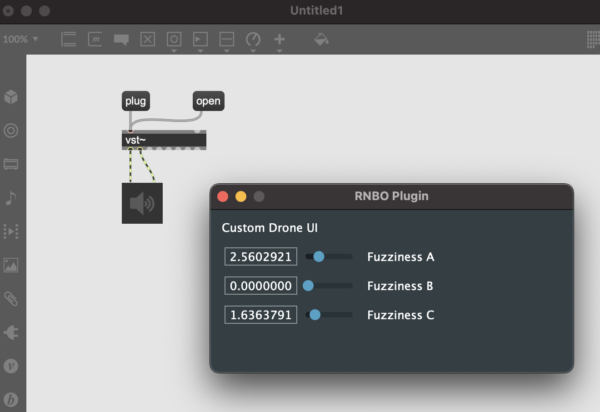

# Making a Custom UI with JUCE

The JUCE plugin template uses the same code to build its user interface as the default VST/AU export. This default view lists all of the parameters available on your RNBO device and allows you to edit them. If you want to design your own user interface, then you'll need to familiarize yourself with building a custom interface using JUCE. A full course on using JUCE is outside the scope of this guide, but we can provide some quick tips for getting started, and hopefully help you avoid a couple of early pitfalls.

## A Word on the Projucer

If you've built a JUCE project before, you may have used the Projucer. This application is a build system for build systems. It doesn't build your plugin directly, but rather it builds and Xcode or Visual Studio project that you can then use to build your plugin. You may have noticed that we're not using the Projucer with this template. This is by design, as the CMake-based system that we're using is more flexible and easier to maintain. However, if we want to design a custom interface using the UI design tool built into the Projucer, then we'll need to adopt a hybrid model. Essentially, we use the Projucer to design our user interface, but we don't use the Projucer to build our build system. Rather, we still use CMake instead of the Projucer.

## Getting Started

For this example, we're going to create a custom user interface for a simple drone patcher. We're going to be making a plugin and not a desktop app, but the exact same steps should work for a desktop application as well. The patcher will produce a drone with adjustable timbre on a single audio channel. It looks like this:


Let's make a simple interface for this patcher with three JUCE sliders. First, download the Projucer if you haven't already. Create a new project, selecting the Basic plug-in project template. Use the defaults for modules and exporters (we won't be using these anyway). Now we need to decide where to save the `.jucer` file. We're not really going to be using this file too much, so it might be nice to keep it isolated from the rest of our code. I'm going to make a new folder in the root of the repository called `ui` and save the JUCE project there. After creating the project, your directory structure should look something like this:


The Projucer will automatically create four files for the PluginProcessor and PluginEditor. We won't be using these, so you can just delete them.

By default the GUI editor is not enabled. You may need to enable it from the Tools menu.


Create a new component. I named mine RootComponent because it's hard to come up with a good, original name. You can call yours whatever you want. Now let's add three sliders to our component.


Now we have two main tasks ahead of us.

1. Replace the default RNBO plugin UI with our custom interface.
2. Connect our sliders to the RNBO parameters.

First, we need to make sure that the RootComponent.cpp and RootComponent.h files get added to our project. Oh, and since we're not building a desktop application, we want to comment out the line in `CMakeLists.txt` that includes `App.cmake`. So first modify `CMakeLists.txt` as follows:

```cmake
# setup your application, you can remove this include if you don't want to build applications
# include(${CMAKE_CURRENT_LIST_DIR}/App.cmake)

# setup your plugin(s), you can remove this include if you don't want to build plugins
include(${CMAKE_CURRENT_LIST_DIR}/Plugin.cmake)
```

Now find `Plugin.cmake` in the repository root and add the two files.

```cmake
target_sources(RNBOAudioPlugin PRIVATE
  "${RNBO_CPP_DIR}/adapters/juce/RNBO_JuceAudioProcessor.cpp"
  "${RNBO_CPP_DIR}/adapters/juce/RNBO_JuceAudioProcessorEditor.cpp"
  "${RNBO_CPP_DIR}/RNBO.cpp"
  "ui/NewProject/Source/RootComponent.cpp"
  ${RNBO_CLASS_FILE}
  )

include_directories(
  "${RNBO_CPP_DIR}/"
  "${RNBO_CPP_DIR}/common/"
  "${RNBO_CPP_DIR}/adapters/juce/"
  "ui/NewProject/Source"
  )
```

Now use CMake in the usual way to generate and build. That might look something like:

```sh
cd build
cmake -G Ninja ..
cmake --build .
```

The plugin should build without errors. However, we haven't added our custom UI yet. In order to do that, we'll need to modify some of the supporting files that Max exports with the C++ source files, including `RNBO_JuceAudioProcessorEditor.h` and `RNBO_JuceAudioProcessorEditor.cpp`. We need to be careful though—these files are exported from Max whenever we do a C++ code export. So, if we modify the files in `export/rnbo/adapters/juce` and then export our patch again, our changes will be overwritten by the default files. So we need to make a few small changes.

1. Copy `RNBO_JuceAudioProcessorEditor.h`, `RNBO_JuceAudioProcessorEditor.cpp`, `RNBO_JuceAudioProcessor.h` and `RNBO_JuceAudioProcessor.cpp` to `src`. Rename them to `Custom_JuceAudioProcessorEditor.h`, `Custom_JuceAudioProcessorEditor.cpp`, `Custom_JuceAudioProcessor.h` and `Custom_JuceAudioProcessor.cpp`.
2. In `Custom_JuceAudioProcessorEditor.h`, replace all instances of `RNBOAudioProcessorEditor` with `CustomAudioProcessorEditor`.
3. In `Custom_JuceAudioProcessorEditor.cpp`, at the top of the file, change `#include "RNBO_JuceAudioProcessorEditor.h"` to `#include "Custom_JuceAudioProcessorEditor.h"`.
4. In `Custom_JuceAudioProcessorEditor.cpp`, replace all instances of `RNBOAudioProcessorEditor` with `CustomAudioProcessorEditor`.
5. In `Custom_JuceAudioProcessor.cpp`, at the top of the file, change your includes to reference our new, custom headers.

```c
#include "Custom_JuceAudioProcessor.h"
#include "Custom_JuceAudioProcessorEditor.h"
#include "RNBO_JuceAudioProcessorUtils.h"
```

6. In `Custom_JuceAudioProcessor.cpp`, replace all instances `RNBOAudioProcessorEditor` with `CustomAudioProcessorEditor`.
7. Modify `Plugin.cmake` to use the new, custom implementation of `CustomAudioProcessorEditor`:

```cmake
target_sources(RNBOAudioPlugin PRIVATE
  "src/Custom_JuceAudioProcessor.cpp"
  "src/Custom_JuceAudioProcessorEditor.cpp"
  "${RNBO_CPP_DIR}/RNBO.cpp"
  "ui/NewProject/Source/RootComponent.cpp"
  ${RNBO_CLASS_FILE}
  )

include_directories(
  "${RNBO_CPP_DIR}/"
  "${RNBO_CPP_DIR}/common/"
  "${RNBO_CPP_DIR}/adapters/juce/"
  "src"
  "ui/NewProject/Source"
  )
```

Make sure that everything is working by trying to build. You may have to remove the `build` directory and start from scratch.

```sh
rm -rf build
mkdir build
cd build
cmake .. -G Xcode
cmake --build .
```

If you're seeing some errors, you can try opening the Xcode project or the Visual Studio project and building. The IDE might help you better understand what went wrong. Also, carefully review the steps above. It's easy to overlook something but each step is very important. Hopefully you're able to get it building, and we can now add our custom UI.

## Switching to our Custom UI

Open `Custom_JuceAudioProcessorEditor.cpp` and find the constructor, which should look something like this:

```cpp
//==============================================================================
CustomAudioProcessorEditor::CustomAudioProcessorEditor(AudioProcessor* const p, CoreObject& rnboObject)
: AudioProcessorEditor (p)
, _rnboObject(rnboObject)
, _parameterInterface(_rnboObject.createParameterInterface(ParameterEventInterface::SingleProducer, this))
{
	jassert (p != nullptr);
	setOpaque (true);

	addAndMakeVisible (_panel);

	const int numParams = p->getParameters().size();
	int totalHeight = 0;

	for (int i = 0; i < numParams; ++i)
	{
		juce::String name (p->getParameters()[i]->getName(256));
		if (name.trim().isEmpty())
			name = "Unnamed";

		ProcessorParameterPropertyComp* const pc = new ProcessorParameterPropertyComp (name, *p, i);
		_params.add (pc);
		totalHeight += pc->getPreferredHeight();
	}

    PresetPropertyComp* const presetChooserComponent = new PresetPropertyComp (*p);
    _presetChooserComponents.add (presetChooserComponent);
    totalHeight += presetChooserComponent->getPreferredHeight();

	_panel.addProperties (_params);
    _panel.addProperties (_presetChooserComponents);

	setSize (400, jlimit (25, 400, totalHeight));
}
```

As you can see, this is where the editor (aka the interface) adds all of the default components, including the sliders that normally let the user adjust each parameter of the RNBO device. This is where we can add in our custom UI. First, we need to include the header for our UI and add it to the class definition for a `CustomAudioProcessorEditor`. So we modify `Custom_JuceAudioProcessorEditor.h` in the following way:

```cpp
// Custom_JuceAudioProcessorEditor.h

// ...

#include "JuceHeader.h"
#include "RNBO.h"

// 1. Include our custom component
#include "RootComponent.h"

// ...

//==============================================================================
CoreObject&								_rnboObject;
ParameterEventInterfaceUniquePtr		_parameterInterface;

// 2. We can delete the PropertyPanel and the arrays of PropertyComponents. Instead
// we just create our RootComponent custom UI view.
RootComponent							_rootComponent;
```

Now we need to use our `RootComponent` in `Custom_JuceAudioProcessorEditor.cpp`. First, in the constructor, we add our custom RootComponent to the view instead of the default components. 

```cpp
// Custom_JuceAudioProcessorEditor.cpp
//==============================================================================
CustomAudioProcessorEditor::CustomAudioProcessorEditor(AudioProcessor* const p, CoreObject& rnboObject)
: AudioProcessorEditor (p)
, _rnboObject(rnboObject)
, _parameterInterface(_rnboObject.createParameterInterface(ParameterEventInterface::SingleProducer, this))
{
	jassert (p != nullptr);
	setOpaque (true);

	addAndMakeVisible (_rootComponent);

	setSize (_rootComponent.getWidth(), _rootComponent.getHeight());
}
```

Next we need to fix the `resized` method, which still references the now nonexistent `_panel` property.
s
```cpp
// Custom_JuceAudioProcessorEditor.cpp
void CustomAudioProcessorEditor::resized()
{
	// _panel.setBounds (getLocalBounds());
}
```

Finally, we need to adjust the method `updateAllParams`. We'll return to this in a minute, but for now let's just delete the body of this function since it references the now nonexistent `_params` property.

```cpp
// Custom_JuceAudioProcessorEditor.cpp
void CustomAudioProcessorEditor::updateAllParams()
{
	// Empty for now
}
```

Our UI won't be functional, but with these changes we should at least be able to see our custom UI. Let's build the plugin.

```sh
cd build
cmake --build .
```

This should put a file `RNBO Plugin.vst3` into `build/RNBOAudioPlugin_artefacts/Debug/VST3`. You should just be able to drop this into Max—I personally had a bit of trouble getting Max to recognize this file as a VST. But if you make a vst~ object, you can send vst~ the "plug" message to load the built plugin manually, and then send vst~ the "open" message to pop open the UI. And look! It's our custom UI.



We're almost there, we just need to hook up our sliders. 

## Connecting the Sliders

To make our sliders functional, we'll need to connect each slider to one of our RNBO parameters. We need to set up a bidirectional binding, where updating one of the sliders updates the RNBO parameter, and where changing the RNBO parameter updates the corresponding slider. There's a number of different ways to do this, and you can almost definitely find a smarter way to do it that what we're about to do here. But this is one way to set it up that is good enough to get started.

First, we're going to edit our definition of RootComponent, adding a function that lets us pass the RNBO object. Open up `RootObject.h`. At the top of the file, include the RNBO header.

```cpp
//[Headers]     -- You can add your own extra header files here --
#include <JuceHeader.h>
#include "RNBO.h"
//[/Headers]
```

Now add the following between the `[UserMethods]` tags:

```cpp
//[UserMethods]     -- You can add your own custom methods in this section.
void setRNBOObject(RNBO::CoreObject *obj);
void updateSliderForParam(unsigned long index, double value);
//[/UserMethods]
```

Also add the following private instance variables
```cpp
//[UserVariables]   -- You can add your own custom variables in this section.
RNBO::CoreObject *_coreObject;

unsigned long sliderParameterIndexes[3]; // used to store the index of the parameters that we want to control
//[/UserVariables]
```

Now let's implement `setRNBOObject`. Open up `RootObject.cpp` and add the following after `[MiscUserCode]`.

```cpp
//[MiscUserCode] You can add your own definitions of your custom methods or any other code here...
void RootComponent::setRNBOObject(RNBO::CoreObject *obj)
{
    RNBO::ParameterInfo parameterInfo;
    _coreObject = obj;
    
    for (unsigned long i = 0; i < _coreObject->getNumParameters(); i++) {
        auto parameterName = _coreObject->getParameterId(i);
        if (juce::String(parameterName) == "kink1") {
            
            sliderParameterIndexes[0] = i;
            auto slider = juce__slider.get();
            _coreObject->getParameterInfo(i, &parameterInfo);
            slider->setRange(parameterInfo.min, parameterInfo.max);
            
        } else if (juce::String(parameterName) == "kink2") {
            
            sliderParameterIndexes[1] = i;
            auto slider = juce__slider2.get();
            _coreObject->getParameterInfo(i, &parameterInfo);
            slider->setRange(parameterInfo.min, parameterInfo.max);
            
        } else if (juce::String(parameterName) == "kink3") {
            
            sliderParameterIndexes[2] = i;
            auto slider = juce__slider3.get();
            _coreObject->getParameterInfo(i, &parameterInfo);
            slider->setRange(parameterInfo.min, parameterInfo.max);
        }
    }
}
//[/MiscUserCode]
```

RNBO parameters are stored by index, so we need to walk through each parameter. If the parameter has the name of something that we want to control with one of our sliders, we configure the corresponding slider and store the index of the parameter in `sliderParameterIndexes` for later. Next we need to make the sliders responsive. In `RootObject.cpp` find the function called `sliderValueChanged` and update it as follows:

```cpp
void RootComponent::sliderValueChanged (juce::Slider* sliderThatWasMoved)
{
    //[UsersliderValueChanged_Pre]
    //[/UsersliderValueChanged_Pre]

    if (sliderThatWasMoved == juce__slider.get())
    {
        //[UserSliderCode_juce__slider] -- add your slider handling code here..
        _coreObject->setParameterValue(sliderParameterIndexes[0], sliderThatWasMoved->getValue());
        //[/UserSliderCode_juce__slider]
    }
    else if (sliderThatWasMoved == juce__slider2.get())
    {
        //[UserSliderCode_juce__slider2] -- add your slider handling code here..
        _coreObject->setParameterValue(sliderParameterIndexes[1], sliderThatWasMoved->getValue());
        //[/UserSliderCode_juce__slider2]
    }
    else if (sliderThatWasMoved == juce__slider3.get())
    {
        //[UserSliderCode_juce__slider3] -- add your slider handling code here..
        _coreObject->setParameterValue(sliderParameterIndexes[2], sliderThatWasMoved->getValue());
        //[/UserSliderCode_juce__slider3]
    }

    //[UsersliderValueChanged_Post]
    //[/UsersliderValueChanged_Post]
}
```

As you can see, this is where we use the index value that we stored in `sliderParameterIndexes`. Finally, we need to implement the function `updateSliderForParam`, which we'll call whenever we get a notification from RNBO that the value of one of the sliders has changed. Add the following definition after the definition of `setRNBOObject`, before the closing `[/MiscUserCode]` tag.

```cpp
void RootComponent::updateSliderForParam(unsigned long index, double value)
{
    if (sliderParameterIndexes[0] == index) {
        juce__slider.get()->setValue(value);
    } else if (sliderParameterIndexes[1] == index) {
        juce__slider2.get()->setValue(value);
    } else if (sliderParameterIndexes[2] == index) {
        juce__slider3.get()->setValue(value);
    }
}
//[/MiscUserCode]
```

We're almost there. Now we just need to set up our RootComponent properly, passing it the RNBO object from our `CustomAudioProcessorEditor`. Open up `Custom_JuceAudioProcessorEditor.cpp` and find the constructor. Add a call to `setRNBOObject`, passing the RNBO object.

```cpp
//==============================================================================
CustomAudioProcessorEditor::CustomAudioProcessorEditor(AudioProcessor* const p, CoreObject& rnboObject)
: AudioProcessorEditor (p)
, _rnboObject(rnboObject)
, _parameterInterface(_rnboObject.createParameterInterface(ParameterEventInterface::SingleProducer, this))
{
	jassert (p != nullptr);
	setOpaque (true);

	_rootComponent.setSize(400, 180);
	addAndMakeVisible (_rootComponent);
    _rootComponent.setRNBOObject(&_rnboObject);

	setSize (_rootComponent.getWidth(), _rootComponent.getHeight());
}
```

And now the very last thing that we need to do is to handle any ParameterEvents from RNBO. In `Custom_JuceAudioProcessorEditor.cpp`, find the definition for `handleParameterEvent` and modify it as follows:

```cpp
void CustomAudioProcessorEditor::handleParameterEvent(const ParameterEvent& event) {
    _rootComponent.updateSliderForParam(event.getIndex(), event.getValue());
}
```

That's it. Compile and build. You may need to restart Max, or whatever DAW you're using, in order to see changes to your plugin.

## Epilogue

Obviously this has just scratched the surface of what's possible with custom C++ interfaces. If you want to read more, a great place to get started would be https://www.theaudioprogrammer.com/. In particular, they have a #design-ux-and-ui channel in their Discord that is full of helpful and supportive people. Best of luck and have fun building your custom UI.

