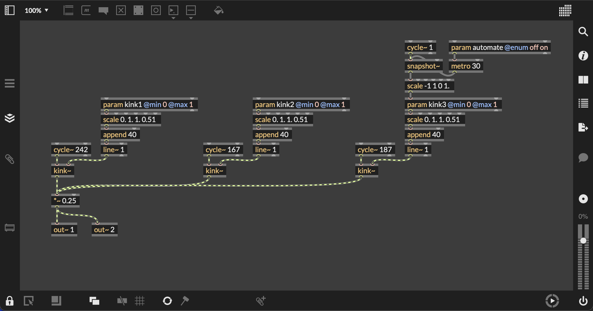
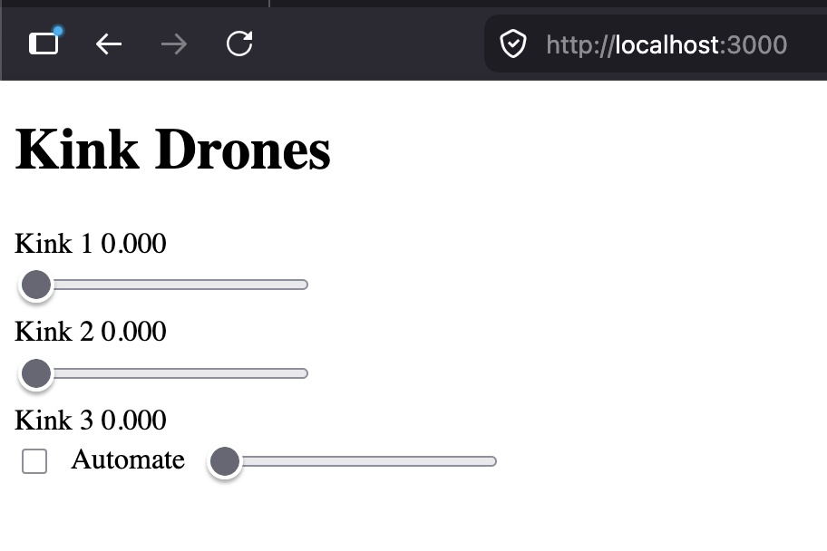
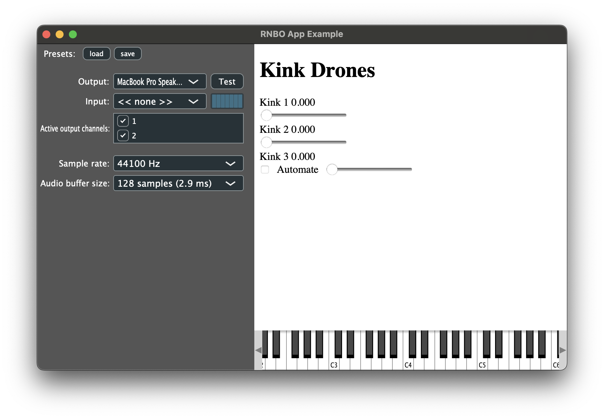
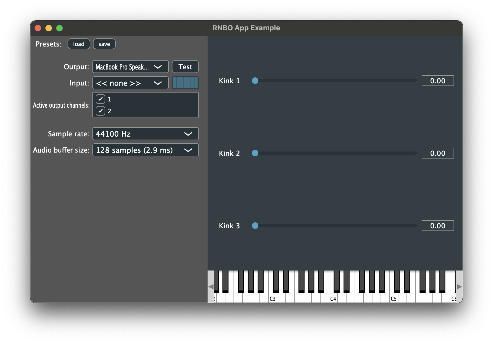

# Making a Custom UI

This guide shows how to build a custom UI for your plugin or standalone app. It does not cover UX best practices or graphic design, but it will show you how to set up a project that creates bidirectional bindings between UI elements and RNBO parameters.

We'll look at the two main approaches that you can use: building a native interface using the JUCE library in C++, or creating a web browser interface that binds to your audio processor.

Each approach has its own advantages. Building a native interface with JUCE can be more efficient, as it doesn't load a separate web browser component. However, using JUCE's WebBrowserComponent lets you work with HTML/CSS/JS to build your interface, which can be much easier. If you run a local web server, you can also modify your interface while your plugin is running using hot reloading.

For most people, we recommend starting with the web-based approach.

## Prerequisites

If you haven't yet followed the setup steps in [README.md](./README.md), you should do so before you follow this tutorial. If you want to follow the guide for building a web-based interface, you will also need to install [Node.js](https://nodejs.org/).

## Switching UI

Take a look at `CMakeLists.txt`. This is the main build configuration file for this project. It defines what files should be compiled together to produce a VST/AU plugin, as well as a standalone application.

If you look through that file, you will see a line like this:

```cmake
set(RNBO_EDITOR_MODE "DEFAULT" CACHE STRING "UI editor: DEFAULT (Generic JUCE controls), NATIVE (Custom JUCE controls), WEBVIEW (WebBrowserComponent)")
```

This defines a configuration variable called `RNBO_EDITOR_MODE`, which can be set to `DEFAULT`, `NATIVE`, or `WEBVIEW`. 

| Value | Interface |
| - | - |
| DEFAULT | Creates a generic audio parameter editor by calling `RNBO::JuceAudioProcessor::createEditor()`. No customization is possible. |
| NATIVE | Uses the JUCE library to create a native interface in C++ |
| WEBVIEW | Uses WebBrowserComponent to create a web-based interface using browser technology |

In order to set this configuration variable, use `-DRNBO_EDITOR_MODE` during CMake configuration. For example:

```sh
cmake .. -DRNBO_EDITOR_MODE=WEBVIEW -G Ninja
```

This command will configure a Ninja-based build, using a WebBrowserComponent to support a custom UI.

## Exporting the example patcher

For this example, we're going to create a custom user interface for a simple drone patcher, which you can export into `/export` as per the instructions over in `README.md`. These instructions in this document should work for both a plugin as well as a desktop app. 

The `three-param-kink.maxpat` patcher will produce a drone with adjustable timbre. You can find it in `patches`, and it looks like this:



Before you continue, make sure that you've exported this patcher into the _export/_ directory. 

> You'll notice that the example patcher will have the name `three-param-kink.cpp`. When you configure CMake, be sure to set `RNBO_CLASS_FILE_NAME` to `three-param-kink.cpp`, so that the build script can find the exported RNBO file.

## Creating a Web-based UI

The easiest and fastest way to build a custom UI is by using WebBrowserComponent, which will let you design and style your UI using HTML/CSS/JavaScript. To start, open your terminal and configure CMake to use the web-based editor.

```
cd build
cmake .. -DRNBO_CLASS_FILE_NAME=three-param-kink.cpp -DRNBO_EDITOR_MODE=WEBVIEW
```

If you look in `src/CustomAudioProcessor.cpp`, you'll see code like this:

```cpp
AudioProcessorEditor* CustomAudioProcessor::createEditor()
{
#if defined(RNBO_EDITOR_NATIVE)
    return new CustomAudioEditor (this, this->_rnboObject);
#elif defined(RNBO_EDITOR_WEBVIEW)
    return new WebBrowserAudioEditor (this, this->_rnboObject);
#else
    return RNBO::JuceAudioProcessor::createEditor();
#endif
}
```

As you can see, when the `RNBO_EDITOR_MODE` is set to `WEBVIEW`, the plugin will load `WebBrowserAudioEditor`. 

### Customizing the web UI with hot reloading

This example comes with a very simple web UI already in place. One thing that's really useful about using a WebBrowserComponent to serve our UI is that we can update our UI while the application is still running.

The `WebBrowserAudioEditor` class is responsible for providing resources to the WebBrowserComponent, like HTML files, images, and JavaScript files. At the top of `WebBrowserAudioEditor.cpp`, you'll see code like this:

```cpp
#if JUCE_ANDROID
static const juce::String kDevServerAddress = "http://10.0.2.2:3000/";
#else
static const juce::String kDevServerAddress = "http://localhost:3000/";
#endif
```

That means that if we run a development server on port 3000, then the web interface will load files from that server. Open your terminal and navigate to `src/webui/`. Assuming you are currently in the root directory, you can run:

```sh
cd src/webui
```

The example UI uses a popular application framework for JavaScript called `vite`. To install all the necessary dependencies, first run `npm install`. You should only need to do this once.

```sh
npm install
```

This should create a folder `node_modules` in `src/webui`, containing all the JavaScript dependencies for the web UI. Now, from the `src/webui` directory, run `npm run dev`.

```sh
npm run dev
```

You should see something in the terminal like the following:

```sh
  VITE v5.4.21  ready in 169 ms

  ➜  Local:   http://localhost:3000/
  ➜  Network: use --host to expose
  ➜  press h + enter to show help
```

If you open up a web server and go to the web address `http://localhost:3000/`, you should see something like this:



This is the interface to your app/plugin, as it will appear in your final build. Because the `vite` server supports hot reloading, you can make changes to this web page and see them appear instantly in your JUCE build.

Close the web browser, but leave the dev server running. Now we can build the app and plugin. 

First, let's build the web UI's production bundle. Open up another terminal window so you can leave the dev server running. 

```sh
cd src/webui
npm run build
```

Now build the app and plugin. Assuming again that you are in the root directory, you can run:

```
cd build
cmake --build .
```

This should build a JUCE standalone app to `build/RNBOApp_artefacts/Release/RNBO App Example.app` (or to `build/RNBOApp_artefacts/Debug/RNBO App Example.app` if you're using a debug configuration). After the build script finishes running, open the app. When you open the standalone app, you'll see something like this:



Now, if you left your dev server running, you can go into the HTML file at `src/webui/index.html` and make some changes and see them update live. You can change whatever you want, for example adding some inline style or changing the text. 

```html
    <body>
        {# <h1>Kink Drones</h1> #}
        <h1>My new cool title</h1>
        <div id="app">
```


### Binding the interface to the engine

Let's take a closer look at the definition of `WebBrowserAudioEditor` to see how this class binds the sliders in the app to the parameters of the RNBO export. In `src/WebBrowserAudioEditor.h`, you'll see where the editor creates some controller objects called _relays_.

```cpp
    WebSliderRelay _kink1Relay { "kink1" };
    WebSliderRelay _kink2Relay { "kink2" };
    WebSliderRelay _kink3Relay { "kink3" };
    WebToggleButtonRelay _automateRelay { "automate" };
```

These classes are new to JUCE 8. When we construct the `WebBrowserComponent` subclass (`SinglePageBrowser`), we pass these relays as options to the constructor. This creates event handlers on the JavaScript end.

| The identifier string that you pass to the relay constructor will be how the named parameter appears on the JavaScript end.


```cpp
    SinglePageBrowser _webComponent {
        WebBrowserComponent::Options{}
            .withBackend (WebBrowserComponent::Options::Backend::webview2)
            .withWinWebView2Options (WebBrowserComponent::Options::WinWebView2{}
                .withUserDataFolder (File::getSpecialLocation (
                    File::SpecialLocationType::tempDirectory)))
            .withNativeIntegrationEnabled()
            .withOptionsFrom (_kink1Relay)
            .withOptionsFrom (_kink2Relay)
            .withOptionsFrom (_kink3Relay)
            .withOptionsFrom (_automateRelay)
            .withKeepPageLoadedWhenBrowserIsHidden()
            .withResourceProvider ([this] (const auto& url) { return getResource (url); })
    };
```

This provides the webpage with the name of the available relays, so that the sliders in the web page can connect to them. In the definiton of `SinglePageBrowser`, we also declare some attachments.

```
    WebSliderParameterAttachment _kink1Attachment;
    WebSliderParameterAttachment _kink2Attachment;
    WebSliderParameterAttachment _kink3Attachment;
    WebToggleButtonParameterAttachment _automateAttachment;
```

These attachments create a bidirectional attachment between the relay and the Audio Parameters themselves. In the `SinglePageBrowser` constructor, we initialize these with both the relays and the parameters.

```cpp
static juce::RangedAudioParameter&
findParameter(RNBO::JuceAudioProcessor* p, const juce::String& name)
{
    for (auto* param : p->getParameters())
    {
        if (param->getName(128) == name)
            return static_cast<juce::RangedAudioParameter&>(*param);
    }

    throw std::runtime_error("Parameter not found: " + name.toStdString());
}

//==============================================================================
// Members are initialized in declaration order (see WebBrowserAudioEditor.h).
// Relays and _webComponent use default member initializers; the
// WebSliderParameterAttachment members need the processor's parameters so they
// are initialized here.
WebBrowserAudioEditor::WebBrowserAudioEditor (RNBO::JuceAudioProcessor* const p,
                                              RNBO::CoreObject& rnboObject)
    : AudioProcessorEditor (p)
    , _audioProcessor (p)
    , _rnboObject (rnboObject)
    , _kink1Attachment(findParameter(p, "kink1"), _kink1Relay, nullptr)
    , _kink2Attachment(findParameter(p, "kink2"), _kink2Relay, nullptr)
    , _kink3Attachment(findParameter(p, "kink3"), _kink3Relay, nullptr)
    , _automateAttachment(findParameter(p, "automate"), _automateRelay, nullptr)
{
    // Start hidden — pageFinishedLoading will reveal the webview once window.__JUCE__ is ready.
    addChildComponent (_webComponent);

    // Try the dev server first. If nothing is listening on that port,
    // pageLoadHadNetworkError fires quickly and redirects to getResourceProviderRoot().
    _webComponent.goToURL (kDevServerAddress);

    setSize (400, 320);
}
```

This is everything that we need to do on the C++ side. Creating and positioning the UI elements is all handled in JavaScript.

### Creating the web interface

JUCE provides a JavaScript framework to expose the parameters to the web interface. At the top of `src/webui/main.js`, you'll see an import for some of these functions.

```js
import { getSliderState, getToggleState } from 'juce-framework-frontend';
```

These functions return a `state` object that provides a getter and setter for the parameter state. The `bindToggleParam` function demonstrates how to use these:

```js
function bindToggleParam(name, toggleId) {
    const toggle = document.getElementById(toggleId);
    const state  = getToggleState(name);

    state.valueChangedEvent.addListener(() => {
        toggle.checked = state.getValue();
    });

    toggle.addEventListener('change', () => {
        state.setValue(toggle.checked);
    });
}

bindToggleParam('automate', 'toggle-automate');
```

As you can see, this function calls `document.getElementById` to get an HTML element with a given ID. For this function to return successfully, there must be a corresponding element in the HTML. Looking at `src/webui/index.html`, we can find the toggle in question:

```html
<div style="display: flex; align-items: center; gap: 10px;">
<input type="checkbox" id="toggle-automate"><label for="toggle-automate">Automate</label>
<input type="range" id="slider-kink3" min="0" max="1" step="0.001" value="0">
</div>
```

### Building the web application

We've already seen how to use the dev server to change the webpage dynamically while the app is running. However, for the release version of the plugin, you will load the web page from the application binary itself. In `CMakeLists.txt`, you'll see where the web page is loaded into the binary:

```cmake
# Compile web UI files into the binary — only needed for the WEBVIEW editor.
if(RNBO_EDITOR_MODE STREQUAL "WEBVIEW")
    juce_add_binary_data(RNBOUIData
        NAMESPACE RNBOUIData
        SOURCES
        ${CMAKE_CURRENT_LIST_DIR}/src/webui/dist/index.html
        ${CMAKE_CURRENT_LIST_DIR}/src/webui/dist/index.js
    )
endif()
```

These files `src/webui/dist/index.html` and `src/webui/dist/index.js` are the bundled version of the Vite application. To generate these, change to the `src/webui` directory and run `npm run build`.

```sh
cd src/webui
npm run build
```

Now when you build your application or plugin, the compiled and bundled version of the Vite application will be included in the program binary. 

## Creating a Native UI

If you don't want your plugin to use a web component, you can use JUCE's UI classes to build a native C++ interface. The file `src/CustomAudioEditor.h` defines the `CustomAudioEditor` class, which implements a simple native interface for the RNBO patcher `patches/three-param-kink.maxpat`.

### Configuring CMake

To configure the template to use a native JUCE interface, set `RNBO_EDITOR_MODE` to `NATIVE` when configuring CMake:

```sh
cmake .. -DRNBO_EDITOR_MODE=NATIVE -G Ninja
```

If you look at `src/CustomAudioProcessor.cpp`, you can see where the definition will tell the processor to load `CustomAudioEditor`:

```cpp
juce::AudioProcessorEditor* CustomAudioProcessor::createEditor()
{
#if defined(RNBO_EDITOR_NATIVE)
    return new CustomAudioEditor (this, this->_rnboObject);
#elif defined(RNBO_EDITOR_WEBVIEW)
    return new WebBrowserAudioEditor (this, this->_rnboObject);
#else
    return RNBO::JuceAudioProcessor::createEditor();
#endif
}
```

If you build the project now with `cmake --build .`, and open the application in `build/RNBOApp_artefacts`, you should see something like this:



### Creating the interface

In `CustomAudioEditor.h`, you can see where the class creates the sliders, and the labels for the slider:

```cpp
Slider _kink1Slider, _kink2Slider, _kink3Slider;
Label  _kink1Label,  _kink2Label,  _kink3Label;
```

You will also see the attachments for each of these sliders:

```cpp
SliderParameterAttachment _kink1Attachment;
SliderParameterAttachment _kink2Attachment;
SliderParameterAttachment _kink3Attachment;
```

Unlike the web-based interface, there's no need for a relay here. In `src/CustomAudioEditor.cpp`, you can see how the attachments are bound to RNBO audio parameters.

```cpp
static juce::RangedAudioParameter&
findParameter(RNBO::JuceAudioProcessor* p, const juce::String& name)
{
    for (auto* param : p->getParameters())
    {
        if (param->getName(128) == name)
            return static_cast<juce::RangedAudioParameter&>(*param);
    }

    throw std::runtime_error("Parameter not found: " + name.toStdString());
}

CustomAudioEditor::CustomAudioEditor (RNBO::JuceAudioProcessor* const p,
                                      RNBO::CoreObject& rnboObject)
    : AudioProcessorEditor (p)
    , _audioProcessor (p)
    , _rnboObject (rnboObject)
    , _kink1Attachment(findParameter(p, "kink1"), _kink1Slider)
    , _kink2Attachment(findParameter(p, "kink2"), _kink2Slider)
    , _kink3Attachment(findParameter(p, "kink3"), _kink3Slider)
```

Remarkably, this is really all we need to do in order to synchronize the state of the slider and the state of the corresponding audio parameter. If you're curious, you can also see how JUCE handles layout for the various controls:

```cpp
void CustomAudioEditor::resized()
{
    auto area = getLocalBounds().reduced (16);
    const int rowHeight = area.getHeight() / 3;

    auto layoutRow = [&] (Label& label, Slider& slider)
    {
        auto row = area.removeFromTop (rowHeight);
        label.setBounds (row.removeFromLeft (60));
        slider.setBounds (row);
    };

    layoutRow (_kink1Label, _kink1Slider);
    layoutRow (_kink2Label, _kink2Slider);
    layoutRow (_kink3Label, _kink3Slider);
}
```

## Epilogue

We've just scratched the surface of what's possible with custom HTML and native C++ interfaces.

The examples in this guide intentionally stay small: a few sliders, a toggle, and direct parameter bindings. Real applications will often need more than this. You might want to add waveform displays, parameter grouping, preset browsers, MIDI visualizers, spectrum analyzers, patch management, custom graphics, or entirely different interaction models.

The important thing to understand is that the binding layer scales naturally. Whether you're using native JUCE widgets or a web interface, the core idea stays the same:

1. Export parameters from RNBO
2. Locate the corresponding audio parameters in the processor
3. Attach those parameters to UI controls
4. Let JUCE synchronize state changes in both directions

Once this connection is in place, the rest of the interface becomes a normal application development problem.

If you're experimenting, the web workflow is usually the fastest place to start. Hot reloading makes iteration very quick, and modern HTML/CSS tooling gives you access to a large ecosystem of UI libraries and design tools. If you later need tighter integration, lower overhead, or access to platform-specific functionality, moving to a native JUCE interface is straightforward.

From here, the next step is simply to start replacing the example controls with your own interface and connecting them to your patcher's parameters.
