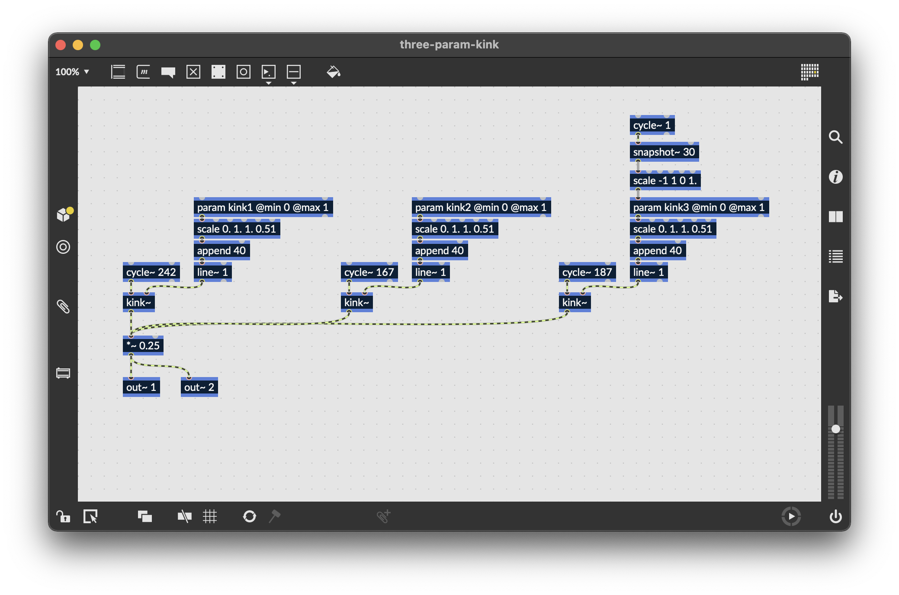

# Making a Custom UI

This document covers two use cases. First, we'll look at the entry points for a custom interface, and see how to swap out the default RNBO interface for one that you write yourself. Next, we'll go through an example of building an interface with the Projucer, and binding UI elements to RNBO code.

Please note, if you haven't yet followed the setup steps in `README.md`, you should do so before you follow this tutorial.

## Switching to a Custom UI

The files `src/CustomAudioProcessor` and `src/CustomAudioEditor` are starting points for a custom UI.
`CustomAudioProcessor` returns `RNBO::JuceAudioProcessorEditor` by default, so the first step to making your own UI is to modify the code to return `CustomAudioProcessor` instead.

Open up `CustomAudioProcessor.cpp` and modify the section at the bottom so you are using the `CustomAudioEditor`.

```cpp
AudioProcessorEditor* CustomAudioProcessor::createEditor()
{
    //Change this to use your CustomAudioEditor
    return new CustomAudioEditor (this, this->_rnboObject);
    //return RNBO::JuceAudioProcessor::createEditor();
}
```

## Building a Custom UI with the Projucer

### A Word on the Projucer

JUCE uses the Projucer to set up JUCE projects. It doesn't build your plugin directly, but rather it builds an Xcode or Visual Studio project that you can then use to build your plugin. We're using CMake instead of the Projucer in this project, as the CMake-based system that we're using is more flexible and easier to maintain. However, that doesn't mean that we can't use the UI editor inside of the Projucer if we want to. Basically, we can use the Projucer to design our user interface, but we don't use the Projucer to build our build system. We use a mixed approach, with CMake for building and the Projucer for editing the UI.

### Getting Started

For this example, we're going to create a custom user interface for a simple drone patcher, which you can export into `/export` as per the instructions over in `README.md`. These instructions in this document should work for both a plugin as well as a desktop app. 

The `three-param-kink.maxpat` patcher will produce a drone with adjustable timbre. You can find it in `patches`, and it looks like this:



Let's make a simple interface for this patcher with three JUCE sliders. First, download the Projucer if you haven’t already. The Projucer is part of JUCE, but the JUCE Github repository does not contain a Projucer executable. To get the Projucer, instead download a JUCE installer for your platform from the JUCE website.

Create a new project, selecting the Basic plug-in project template. Use the defaults for modules and exporters (we won't be using these anyway). Now we need to decide where to save the `.jucer` file. We're not really going to be using this file too much, so it might be nice to keep it isolated from the rest of our code. I'm going to make a new folder in the root of the repository called `ui`, and I'll save the JUCE project there. After creating the project, your directory structure should look something like this:


The Projucer will automatically create four files for the PluginProcessor and PluginEditor. We won't be using these, so you can just delete them.

By default the GUI editor is not enabled. You may need to enable it from the Tools menu.


From the "GUI Editor" menu, select "Add new GUI Component" to add a `.cpp` and `.h` file for your new component. I named mine `RootComponent` because it's hard to come up with a good, original name. You can call yours whatever you want. Now let's add three sliders to our component. Navigate to "Subcomponents" and right-click to add these sliders. Let's also be careful to change the name of each component. Our three parameters are called `kink1`, `kink2`, and `kink3`, so give the sliders each one of these names. Later on, we'll use this name to map each slider to the RNBO parameter with the same name.

When you are done, "Save All."


Now we have two main tasks ahead of us.

1. Replace the default RNBO plugin UI with our custom interface.
2. Connect our sliders to the RNBO parameters.

### Adding the Interface to CMake

First, we need to make sure that the RootComponent.cpp and RootComponent.h files get added to our project. First, add these files to `Plugin.cmake` in the repository root.

```cmake
target_sources(RNBOAudioPlugin PRIVATE
  "${RNBO_CPP_DIR}/adapters/juce/RNBO_JuceAudioProcessor.cpp"
  "${RNBO_CPP_DIR}/adapters/juce/RNBO_JuceAudioProcessorEditor.cpp"
  "${RNBO_CPP_DIR}/RNBO.cpp"
  ${RNBO_CLASS_FILE}
  src/Plugin.cpp
  src/CustomAudioEditor.cpp
  src/CustomAudioProcessor.cpp
  ui/NewProject/Source/RootComponent.cpp
  )

include_directories(
  "${RNBO_CPP_DIR}/"
  "${RNBO_CPP_DIR}/common/"
  "${RNBO_CPP_DIR}/adapters/juce/"
  "${RNBO_CPP_DIR}/src/3rdparty/"
  "src"
  "ui/NewProject/Source"
  )
```

Next, find `App.cmake` and add these files there as well.

```cmake
target_sources(RNBOApp
  PRIVATE
  src/Main.cpp
  src/MainComponent.cpp
  src/CustomAudioEditor.cpp
  src/CustomAudioProcessor.cpp
  ui/NewProject/Source/RootComponent.cpp

  ${RNBO_CLASS_FILE}

  ${RNBO_CPP_DIR}/RNBO.cpp
  ${RNBO_CPP_DIR}/adapters/juce/RNBO_JuceAudioProcessorUtils.cpp
  ${RNBO_CPP_DIR}/adapters/juce/RNBO_JuceAudioProcessorEditor.cpp
  ${RNBO_CPP_DIR}/adapters/juce/RNBO_JuceAudioProcessor.cpp
  )

include_directories(
  "src"
  "${RNBO_CPP_DIR}/"
  "${RNBO_CPP_DIR}/src"
  "${RNBO_CPP_DIR}/common/"
  "${RNBO_CPP_DIR}/adapters/juce/"
  "${RNBO_CPP_DIR}/src/3rdparty/"
  "ui/NewProject/Source"
  )
```

Now use CMake in the usual way to generate and build. Remember to set the correct name for `RNBO_CLASS_FILE` on line 17 of `CMakeLists.txt`, for example, `three-param-kink.cpp`. Once you've done so, you can enter something like this into your terminal:

```sh
cd build
cmake -G Ninja ..
cmake --build .
```

The plugin should build without errors, but of course we don't see our new `RootComponent` with its sliders yet. We need to add the `RootComponent` to our custom UI.

### Adding the Custom Root Component
Open up `src/CustomAudioEditor.h`. First, add `RootComponent.h` to the include definitions.

```cpp
#include "JuceHeader.h"
#include "RNBO.h"
#include "RNBO_JuceAudioProcessor.h"
#include "RootComponent.h"
```

Next, find the declaration for the default `_label` member variable and replace it with one for a `RootComponent` component.

```cpp
// Label                _label;
RootComponent           _rootComponent;
```

Finally, open up `src/CustomAudioEditor.cpp`. Find the constructor, where the default label is configured and sized. Replace that code with new code to size and configure the `RootComponent`.

```cpp
CustomAudioEditor::CustomAudioEditor (RNBO::JuceAudioProcessor* const p, RNBO::CoreObject& rnboObject)
    : AudioProcessorEditor (p)
    , _rnboObject(rnboObject)
    , _audioProcessor(p)
{
    _audioProcessor->AudioProcessor::addListener(this);

    // _label.setText("Hi I'm Custom Interface", NotificationType::dontSendNotification);
    // _label.setBounds(0, 0, 400, 300);
    // _label.setColour(Label::textColourId, Colours::black);
    // addAndMakeVisible(_label);
    // setSize (_label.getWidth(), _label.getHeight());

    addAndMakeVisible(_rootComponent);
    setSize(_rootComponent.getWidth(), _rootComponent.getHeight());
}
```

Rebuild using CMake, and you should see the generated UI loading in place of the default custom UI.

```sh
cd build
cmake ..
cmake --build .
```

### Connecting the Sliders

To make the sliders functional, we modify `RootComponent.h` and `RootComponent.cpp`. When the sliders change, we want to update the parameters of the `AudioProcessor`. When we get a parameter change notification from the `AudioProcessor`, we want to update the sliders.

Open up `RootComponent.h`. At the top of the file, include these RNBO header files.

```cpp
//[Headers]     -- You can add your own extra header files here --
#include <JuceHeader.h>
#include "RNBO.h"
#include "RNBO_JuceAudioProcessor.h"
//[/Headers]
```

Now add the following between the `[UserMethods]` tags:

```cpp
//[UserMethods]     -- You can add your own custom methods in this section.
void setAudioProcessor(RNBO::JuceAudioProcessor *p);
void updateSliderForParam(unsigned long index, double value);
//[/UserMethods]
```

Also add the following private instance variables
```cpp
//[UserVariables]   -- You can add your own custom variables in this section.
RNBO::JuceAudioProcessor *processor = nullptr;
HashMap<int, Slider *> slidersByParameterIndex; // used to map parameter index to slider we want to control
//[/UserVariables]
```

We'll need to call `setAudioProcessor` from the `CustomAudioEditor`. Open `CustomAudioEditor.cpp` and add the following line:

```cpp
_rootComponent.setAudioProcessor(p); // <--- add this line
addAndMakeVisible(_rootComponent);
setSize(_rootComponent.getWidth(), _rootComponent.getHeight());
```

Now let's implement `setAudioProcessor`. Open up `RootComponent.cpp` and add the following after `[MiscUserCode]`.

```cpp
//[MiscUserCode] You can add your own definitions of your custom methods or any other code here...
void RootComponent::setAudioProcessor(RNBO::JuceAudioProcessor *p)
{
    processor = p;

    RNBO::ParameterInfo parameterInfo;
    RNBO::CoreObject& coreObject = processor->getRnboObject();

    for (unsigned long i = 0; i < coreObject.getNumParameters(); i++) {
        auto parameterName = coreObject.getParameterId(i);
        RNBO::ParameterValue value = coreObject.getParameterValue(i);
        Slider *slider = nullptr;
        if (juce::String(parameterName) == juce__slider.get()->getName()) {
            slider = juce__slider.get();
        } else if (juce::String(parameterName) == juce__slider2.get()->getName()) {
            slider = juce__slider2.get();
        } else if (juce::String(parameterName) == juce__slider3.get()->getName()) {
            slider = juce__slider3.get();
        }

        if (slider) {
            slidersByParameterIndex.set(i, slider);
            coreObject.getParameterInfo(i, &parameterInfo);
            slider->setRange(parameterInfo.min, parameterInfo.max);
            slider->setValue(value);
        }
    }
}
//[/MiscUserCode]
```

Notice how we use the name of the slider to map the slider to a parameter with the matching ID. Now, in `RootComponent.cpp` find the function called `sliderValueChanged` and update it as follows:

```cpp
void RootComponent::sliderValueChanged (juce::Slider* sliderThatWasMoved)
{
    //[UsersliderValueChanged_Pre]
    if (processor == nullptr) return;
    RNBO::CoreObject& coreObject = processor->getRnboObject();
    auto parameters = processor->getParameters();
    //[/UsersliderValueChanged_Pre]

    if (sliderThatWasMoved == juce__slider.get())
    {
        //[UserSliderCode_juce__slider] -- add your slider handling code here..
        //[/UserSliderCode_juce__slider]
    }
    else if (sliderThatWasMoved == juce__slider2.get())
    {
        //[UserSliderCode_juce__slider2] -- add your slider handling code here..
        //[/UserSliderCode_juce__slider2]
    }
    else if (sliderThatWasMoved == juce__slider3.get())
    {
        //[UserSliderCode_juce__slider3] -- add your slider handling code here..
        //[/UserSliderCode_juce__slider3]
    }

    //[UsersliderValueChanged_Post]
    RNBO::ParameterIndex index = coreObject.getParameterIndexForID(sliderThatWasMoved->getName().toRawUTF8());
    if (index != -1) {
        const auto param = processor->getParameters()[index];
        auto newVal = sliderThatWasMoved->getValue();

        if (param && param->getValue() != newVal)
        {
            auto normalizedValue = coreObject.convertToNormalizedParameterValue(index, newVal);
            param->beginChangeGesture();
            param->setValueNotifyingHost(normalizedValue);
            param->endChangeGesture();
        }
    }
    //[/UsersliderValueChanged_Post]
}
```

This is all we need to control the RNBO patch using the sliders in our custom UI. However, to be really complete, we should also make sure that the sliders will update if RNBO changes the value of a parameter internally. Open `CustomAudioEditor.cpp` and add the following to `audioProcessorParameterChanged`.

```cpp
void CustomAudioEditor::audioProcessorParameterChanged (AudioProcessor*, int parameterIndex, float value)
{
    _rootComponent.updateSliderForParam(parameterIndex, value);
}
```

Now open `RootComponent.cpp` and implement `updateSliderForParam` inside of the `[MiscUserCode]` tags.

```cpp
void RootComponent::updateSliderForParam(unsigned long index, double value)
{
    if (processor == nullptr) return;
    RNBO::CoreObject& coreObject = processor->getRnboObject();
    auto denormalizedValue = coreObject.convertFromNormalizedParameterValue(index, value);
    auto slider = slidersByParameterIndex.getReference((int) index);
    if (slider && (slider->getThumbBeingDragged() == -1)) {
        slider->setValue(denormalizedValue, NotificationType::dontSendNotification);
    }
}
```

That's it. Compile and build. You may need to restart Max, or whatever DAW you're using, in order to see changes to your plugin.

## Epilogue

Obviously this has just scratched the surface of what's possible with custom C++ interfaces. If you want to read more, a great place to get started would be https://www.theaudioprogrammer.com/. In particular, they have a #design-ux-and-ui channel in their Discord that is full of helpful and supportive people. Best of luck and have fun building your custom UI.
