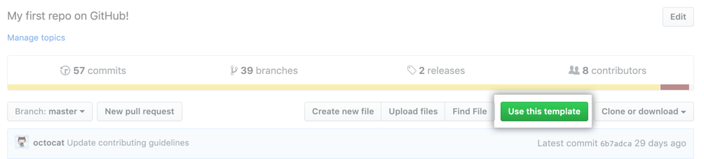
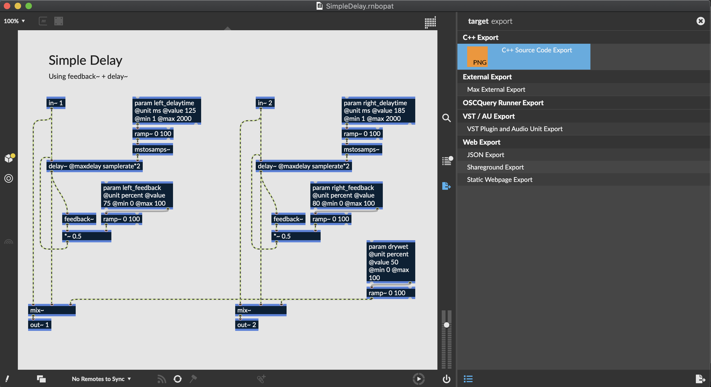

# RNBO JUCE Examples

This template demonstrates how to use RNBO in either a Standalone Desktop application or an Audio Plugin (VST/AU). It uses the C++ source code export feature of RNBO, together with the JUCE application framework. RNBO is part of [Max 8](https://cycling74.com/max8/) made by [Cycling '74](https://cycling74.com/). 

If you want to build an app or plugin for sale, be aware that the JUCE has its own license terms (mostly GPL with the availability of commercial licenses). See their [website](http://www.juce.com/) for further details.

## Prerequisites

- Download and install [CMake](https://cmake.org/download/). Version 3.18 or higher is required. On MacOS, we recommend installing CMake with [Homebrew](https://brew.sh/)
- Download and install [git](https://git-scm.com/downloads).
- Some kind of build system and compiler. You have options here.
 - (MacOS) Install Xcode command line tools by running `sudo xcode-select --install` on the command line. You'll use `make` to compile your application. (You will not be able to use Xcode to build your application unless you install Xcode itself.)
 - (MacOS/Linux/Unix-like) Install [Ninja](https://github.com/ninja-build/ninja/releases), easiest way is probably `brew install ninja` or `sudo apt-get install ninja`
 - (MacOS) Download and install [Xcode](https://developer.apple.com/xcode/resources/). We have tested using Xcode 12.
 - (Windows) Download and install [Visual Studio 2019](https://visualstudio.microsoft.com/vs/). Community Edition is enough!
 - (Linux/Unix-like) use `make`, often already on your system. For debian based systems `sudo apt-get install build-essential`

## File structure

The source code of the application is in the `src/` directory. This directory should contain everything that you need to modify to build your application.

Some notable files/directories:

| Location                          | Explanation   |
| --------------------------------- | ------------- |
| export/                           | The directory into which you should export your RNBO code |
| src/                              | Source for the project - feel free to edit (includes sample UI) |
| build/RNBOApp_artefacts/          | Your built application will end up here |
| build/RNBOAudioPlugin_artefacts/  | Your built plugins will end up here |

## Using this Template

This Github repo is a template, which means you can use it to start your own git-based project using this repository as a starting point. The major difference between a template and a fork is that your new project won't include the commit history of this template--it will be an entirely new starting point. For more see [the official description](https://docs.github.com/en/repositories/creating-and-managing-repositories/creating-a-repository-from-a-template).

### Getting Started

To get started, first create a new repository to hold your project using this repository as a template. If you're viewing this repo on Github, you should see a button at the top of the page that says `Use this template`. 



You can also follow [the official steps](https://docs.github.com/en/repositories/creating-and-managing-repositories/creating-a-repository-from-a-template) on Github for creating a new repository from a template.

Now you need to copy this repository locally. Follow [the official steps](https://docs.github.com/en/repositories/creating-and-managing-repositories/cloning-a-repository) to clone your repository. Once you've cloned your repository locally, you'll need to initialize the JUCE submodule.

```
cd your-project-folder
git submodule update --init --recursive --progress
```

If the above command doesn't work, check your version if git by runing `git --version`. The `--progress` flag wasn't introduced until git `2.11.0`, so if your version is earlier than this you won't have access to it. Strictly speaking you don't need that last `--progress` flag, but it's nice to have some progress indication, especially since installing the JUCE submodule can take a while. That's all you'll need to do to get set up! Now you can start exporting from RNBO and building your project.

### Exporting RNBO

Next, open the RNBO patcher you'd like to work with, and navigate to the export sidebar. Find "C++ Source Code Export" target.



Export your project, making sure to export into the `export` folder in this directory. Your export directory should look something like this:

```
export/
├─ rnbo/
├─ rnbo_source.cpp
├─ README.md
```

**Note:** By default, this project expects the exported source file to be named `rnbo_source.cpp`. If you want to use a different name, see [Renaming your export source](#renaming-your-export-source).

Whenever you make a change to your RNBO patch, remember to export the patch to C++ again, so that your changes will be incorporated when you rebuild. Now that you've exported your RNBO code, it's time to build. 

## Using CMake

CMake is a build system generator. You run CMake to configure a system to build your project, and then run the build script to actually create your program. A typical CMake flow looks something like this:

1. Create the folder (usually `build`) where you actually want to build your project. `cd` into that folder.
2. Run `cmake ..` to configure your build system.
3. Run `cmake --build .` to actually build.

To build this template, start by moving to the build directory (this repository should already have an empty `build` directory).

```sh
cd build
```

### Configuring CMake

Now that we're in the `build` directory, the next step is to configure CMake. At this stage, you choose what build system you want to use, and pass any configuration flags to set up your project to build in a particular way.

#### Choosing a build system

You have a choice of what build system you want to use. Any one of the following will work:

- `cmake .. -G Xcode` (create an Xcode project)
- `cmake .. -G "Visual Studio 16"` (create a Visual Studio 2019 project)
- `cmake .. -G Ninja` (use Ninja to build)
- `cmake ..` (just use the default, which will be `make` on MacOS, Linux and other Unix-like platforms)

You might be wondering which on is "best". We say, if you're familiar with Xcode or Visual Studio or Ninja, just go with that.

#### Choosing debug or release

You can configure CMake to build either a Debug or a Release target. The Debug target is larger and less optimized, but includes symbols that map from the compiled code back to your source file. This lets you set breakpoints in your code, which is helpful for debugging. Use the flag `CMAKE_BUILD_TYPE` flag to choose Debug or Release.

```sh
cmake -DCMAKE_BUILD_TYPE=Release ..
```

#### Renaming your export source

By default, the build script looks for a RNBO export in the `export` folder named `rnbo_source.cpp`. If you export your RNBO patch with a different name, pass that as a configuration argument when you run CMake. For example, to use the Ninja build system and a RNBO export named `slime_sound.cpp`, you could use the following command.

```sh
cmake -DRNBO_CLASS_FILE_NAME=slime_sound.cpp -G Ninja ..
```

#### Choosing a UI system

RNBO provides a default interface for audio plugins, which simply creates a slider for each parameter in your RNBO patch. If you want to create a custom interface, you can configure CMake to use a different interface system.

This template is set up with a starting point for two different custom UI systems. The first uses JUCE to build a native C++ UI.

```sh
cmake -DRNBO_EDITOR_MODE=NATIVE ..
```

The second uses a WebBrowserComponent to build a UI using HTML/CSS/JS. 

```sh
cmake -DRNBO_EDITOR_MODE=WEBVIEW ..
```

See [CUSTOM_UI.md](./CUSTOM_UI.md) for more details on how to build your own UI.

### Building with CMake

Once CMake has finished generating your build system, you can finally build your project.

```
cmake --build .
```

Invoking `cmake` with the `--build` flag tells CMake to build your target, using whatever build tool you chose in the last step. After the build completes, you'll find the executable result in `build/RNBOApp_artefacts/Debug`, and you'll find plugins in `build/RNBOAudioPlugin_artefacts/Debug`.

If you're using the Xcode generator, but you don't have Xcode installed, you might see something like this when you try to build
```sh
% cmake --build .
xcode-select: error: tool 'xcodebuild' requires Xcode, but active developer directory '/Library/Developer/CommandLineTools' is a command line tools instance
```

This simply means that you need to install Xcode, and not just the command line tools.

## Additional Notes and Troubleshooting

### Building Plugins on M1 Macs
When building for M1 Macs, you will want to enable universal builds, so that your target can be used on both Intel and M1 macs. `CMakeLists.txt` has a line you can uncomment to enable universal builds.

### Help! My DAW Won't Load My Plugin
After building your plugin, you may find that it loads in some DAWs but not others. On MacOS, the problem is sometimes code signing. JUCE may incorrectly code sign your VST3 bundle. If you use the `codesign` tool to verify your VST3 bundle

```
codesign --verify --verbose RNBOAudioPlugin_artefacts/Release/VST3/MyPlugin.vst3
```

and you see an error like this:

```
RNBOAudioPlugin_artefacts/Release/VST3/MyPlugin.vst3: code has no resources but signature indicates they must be present
```

you're seeing the issue. Fortunately, you can give the plugin a new, ad-hoc code signature with the following command

```
codesign --force --deep -s - RNBOAudioPlugin_artefacts/Release/VST3/MyPlugin.vst3
```

You'll see a message like:

```
RNBOAudioPlugin_artefacts/Release/VST3/MyPlugin.vst3: replacing existing signature
```

Hopefully, this will resolve the issue.

### MIDI CC and VST3
VST3 introduced some changes to the way plugins handle MIDI data. One way to make newer VST3 plugins behave more like VST2 is to create Parameters for each MIDI CC value on each MIDI channel. You can dip your toes into the [full discussion](https://forums.steinberg.net/t/vst3-and-midi-cc-pitfall/201879/11) if you want, but we disable this behavior by default. If you really want it, you can enable it by commenting out the appropriate line in `CMakeLists.txt`.

### Working with your RNBO Plugin in Unity
You can build a dedicated audio plugin for Unity using our [RNBO Unity Audio Plugin repository](https://github.com/Cycling74/rnbo.unity.audioplugin), which also provides an API that facilitates working with your RNBO export in your C# scripting. Check out that repository for more information.

## Customizing the Project

This project is based on the [JUCE Framework](http://www.juce.com/). Please refer to tutorials from JUCE on building UIs, for instance.

There are details that you might want to change in `App.cmake` for Applications and in `Plugin.cmake` for Plugins.

If you're not interested in the Application or Plugin parts of this project you can remove the associated *include* lines from the `CMakeLists.txt` file.
