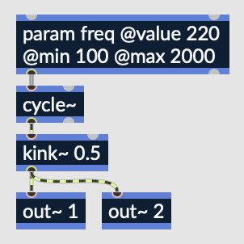

# Working with your Unity Plugin

Creating a generative instrument or audio effect that you can use in Unity is possible with RNBO and this JUCE template. This guide will use a very simple synth plugin with a parameter that sets the frequency of the synth.

Please note that the functionality of this Unity plugin is somewhat limited. For a more flexible Unity plugin, check out the [rnbo.unity.audioplugin](https://github.com/Cycling74/rnbo.unity.audioplugin) repo.

## Configuring your export and `Plugin.cmake`

Let's imagine a very simple sine tone synth with a parameter named "freq" that sets the frequency of the synth. Something like this:



**Important note: with the way that this template is currently configured, you should make sure that you have at least two output channels as shown above.**

Load up this RNBO patch and export it into this template's `/export` directory. Over in `Plugin.cmake`, in the template's root directory, make sure that `Unity` is included on line 2. It should look like this:

```CMake
set(PLUGIN_FORMATS VST3 Unity)
```

This template will build you a `.bundle` on macOS, a `.dll` on Windows, and a `.so` on Linux. This guide will use "RnboAudioPlugin.bundle" to refer to the Unity plugin you've built, but if you are a Windows or Linux user, the same principles should apply.

## Attaching the plugin

Over in your Unity project, in `/Assets`, create a `/Plugins` folder and drop in your `RnboAudioPlugin.bundle`. In the Inspector for the Plugin, check "Load on Startup" and then "Apply."

Create a new **Audio Mixer** and add the RNBO plugin to a track as an effect—for example, the "Master" track. It will be named something like `audioplugin_RnboAudioPlugin`, because Unity prepends `audioplugin_` if the name of your audio plugin does not already start with the string "audioplugin."

To hear your audio plugin in Unity, add an **Audio Source** Game Object and set its Output to the Master track of this Audio Mixer. 

## Addressing the plugin's parameters via C# scripts

Open the master track of your Audio Mixer in Unity's inspector, right click on your "freq" param and select "Expose [...] to script." Over in the Audio Mixer, there should be an "Exposed Parameters" dropdown with your exposed parameter. Rename it to something like "sinFreq."

Now, in one of your scripts, you can set the value that parameter via the `AudioMixer.SetFloat()` method, provided you have the line 

```C#
using UnityEngine.Audio;
```

For example, here's a sort of player controller script that changes RNBO parameters based on player movement. Note that with this script, you'll need to select the mixer that we made earlier in the Inspector for whatever Game Object this script is attached to.

**One important note is that your RNBO device's parameters will show up in Unity as normalized parameters in the range of 0..1.**

```C#
using System.Collections;
using System.Collections.Generic;
using UnityEngine;
using UnityEngine.Audio;

public class PlayerAudio : MonoBehaviour
{
    // the speed for our "Player" character that is assigned this movement/audio script
    public float speed = 10;

    // this will hold the Audio Mixer with our RNBO plugin
    public AudioMixer mixer;

    // a scaling factor for the parameter
    public float cycleScale = 0.1f;

    // Update is called once per frame
    void Update()
    {
        // move the player character left and right
        Vector3 input = new Vector3(Input.GetAxisRaw("Horizontal"), 0, 0);
        Vector3 direction = input.normalized;
        Vector3 velocity = direction * speed;
        Vector3 moveAmount = velocity * Time.deltaTime;

        transform.Translate(moveAmount);

        // change the frequency with horizontal movement, scaled by our scaling factor
        ChangeFreq(mixer, "sinFreq", cycleScale * Mathf.Abs(transform.position.x));
    }

    // change frequency of the cycle~ (normalized param in the range 0..1)
    void ChangeFreq(AudioMixer mixer, string paramName, float freqValue)
    {
        mixer.SetFloat(paramName, freqValue);
    }

}
```

## Using Multiple RNBO Plugins in Unity

You may want to load multiple RNBO plugins into Unity. You'll need to make sure each has a unique name. This is dictated by the `PRODUCT_NAME` field that by default is set to "RNBO Plugin."

In this JUCE template, this field is on line 33 of the `Plugin.cmake` file in the root directory. If you make multiple plugins, all with different values for this PRODUCT_NAME field, you should be able to load them separately into `Assets/Plugins/` in your Unity Project, and load them individually onto a track in your Audio Mixer.
